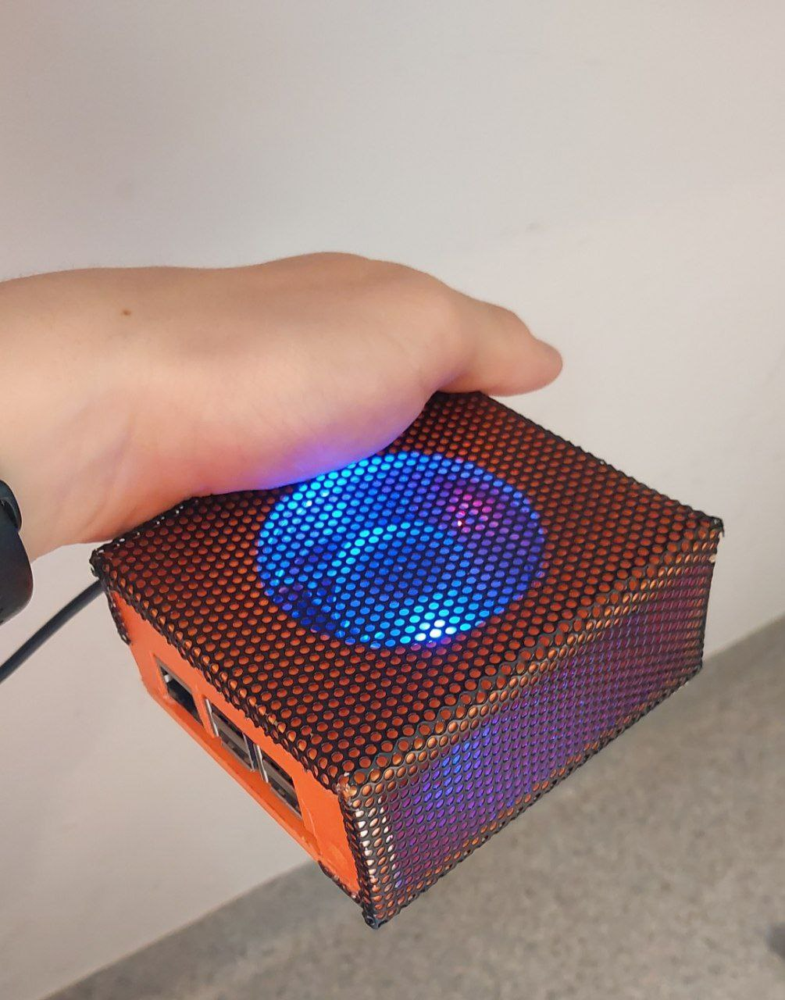

- 👋 Hi, I’m @Ruslastor
- 👀 I’m interested in Embedded Software engineering
- 🌱 I’m currently learning STM32 Register Programming
- ⚡ Fun fact: I'm 20 years old
- 🏊‍♂️ My Hobbies: making games, telegram bots and energy-safe bolids

<h1>My Photo Album</h1>

<table>
  <tr>
    <th><b>Me and an Electrical Bolid EA2 from Iron Warriors team, on competition</b></th>
  </tr>
  <tr>
    <td></td>
  </tr>
  <tr>
    <td><b>France, Albi, Albi Eco Race 2023</b></td>
  </tr>
</table>

<table>
  <tr>
    <th><b>Me and my hosting server for one of Telegram Bots, 
      made out of Raspberry Pi 3 and a cooler.</b></th>
  </tr>
  <tr>
    <td></td>
  </tr>
  <tr>
    <td><b>Lodz, Poland</b></td>
  </tr>
</table>

<table>
  <tr>
    <th><b>Me presenting a boiled for a students</b></th>
  </tr>
  <tr>
    <td></td>
  </tr>
  <tr>
    <td><b>Lodz, Poland</b></td>
  </tr>
</table>

<table>
  <tr>
    <th><b>Eco Arrow 3, Iron Warriors</b></th>
  </tr>
  <tr>
    <td></td>
  </tr>
  <tr>
    <td><b>Krosno, Poland</b></td>
  </tr>
</table>

<table>
  <tr>
    <th><b>Me and my university PCB project</b></th>
  </tr>
  <tr>
    <td></td>
  </tr>
  <tr>
    <td><b>Warsaw, Poland</b></td>
  </tr>
</table>
